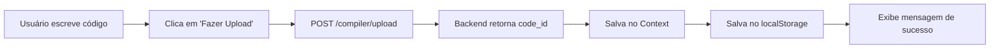

# 🚀 Guia Rápido - Upload de Código

## O que foi implementado?

Foi adicionado um **sistema completo de upload de código** com gerenciamento de estado global usando Context API e localStorage.

## Novidades na Interface

### 1. **Botão de Upload** 🟣
No editor de código, agora existe um novo botão roxo **"Fazer Upload"** ao lado do botão azul "Compilar e Analisar".

**Funcionalidade:**
- Envia o código atual para o backend
- Recebe um `code_id` único
- Salva automaticamente no localStorage
- Exibe mensagem de sucesso/erro

### 2. **Badge "Código Carregado"** ✅
Quando um código é carregado com sucesso, aparece um badge verde ao lado do título do editor.

### 3. **Widget de Status** 📊
Abaixo do editor principal, um novo widget mostra:
- ID do código atual carregado
- Histórico dos últimos 20 uploads
- Opção de limpar histórico

## Como usar?

### Passo 1: Escrever código
```minipar
var x: number = 10
var y: number = 20
print("Soma:", x + y)
```

### Passo 2: Fazer Upload
Clique no botão roxo **"Fazer Upload"** → O código é enviado ao backend

### Passo 3: Ver resultado
- ✅ Mensagem verde de sucesso
- 🆔 Code ID exibido (exemplo: `a1b2c3d4...`)
- 💾 Salvamento automático no navegador

## Onde o código é salvo?

### localStorage do navegador
Os dados ficam salvos mesmo depois de fechar a página:
- `minipar_current_code_id` - ID do código atual
- `minipar_code_history` - Histórico de uploads

## Estrutura de arquivos criados

```
frontend/src/
├── contexts/
│   └── CodeContext.jsx        ← Context React para estado global
├── components/
│   ├── CodeEditor.jsx         ← Atualizado com botão de upload
│   └── CodeStatus.jsx         ← Novo widget de status
└── App.jsx                    ← Envolvido pelo CodeProvider
```

## Usando o Context em outros componentes

```jsx
import { useCodeContext } from '../contexts/CodeContext';

function MeuComponente() {
  const { 
    currentCodeId,      // ID atual
    hasCodeLoaded,      // true/false
    codeHistory         // histórico
  } = useCodeContext();
  
  return (
    <div>
      {hasCodeLoaded && (
        <p>Código carregado: {currentCodeId}</p>
      )}
    </div>
  );
}
```

## API do Context

### Propriedades disponíveis:
| Propriedade | Tipo | Descrição |
|------------|------|-----------|
| `currentCodeId` | string \| null | ID do código atual |
| `codeHistory` | array | Histórico de uploads |
| `hasCodeLoaded` | boolean | Se há código carregado |
| `updateCurrentCodeId` | function | Atualiza o ID atual |
| `clearCurrentCodeId` | function | Limpa o ID atual |
| `clearHistory` | function | Limpa histórico |

## Fluxo completo



## Estados visuais

### Botão de Upload
- **Normal**: Roxo, ícone de upload
- **Disabled**: Cinza (quando código vazio)
- **Loading**: Spinner girando "Enviando..."
- **Hover**: Roxo mais escuro

### Mensagens
- **Sucesso**: 🟢 Fundo verde, mostra code_id
- **Erro**: 🔴 Fundo vermelho, mostra mensagem de erro
- **Auto-dismiss**: Desaparecem após 5 segundos

## Testando

### No navegador
1. Abra DevTools (F12)
2. Vá em Application → Storage → Local Storage
3. Veja as chaves `minipar_*`

### No console
```javascript
// Ver código atual
localStorage.getItem('minipar_current_code_id')

// Ver histórico
JSON.parse(localStorage.getItem('minipar_code_history'))

// Limpar tudo
localStorage.clear()
```

## Troubleshooting

### ❌ Botão desabilitado
- Certifique-se de que há código no editor
- Código vazio desabilita o botão

### ❌ Erro ao fazer upload
- Verifique se o backend está rodando
- URL padrão: `http://127.0.0.1:8000`
- Veja o console do navegador para detalhes

### ❌ Context não funciona
- Certifique-se de que está dentro de `<CodeProvider>`
- Veja se o import está correto

## Próximos passos sugeridos

- [ ] Usar o `currentCodeId` em outros componentes
- [ ] Carregar código do histórico
- [ ] Compartilhar códigos via link
- [ ] Adicionar nomes/tags aos códigos

---

✅ **Implementação completa e funcional!**

